# 以BBa_B3202为例介绍通路图的存储

Example: BBa_B3202

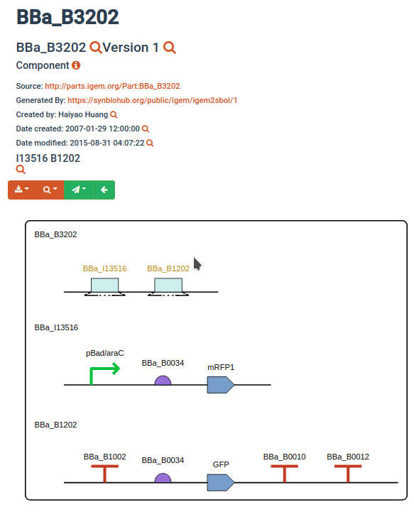


对属性有疑问可查阅 https://sbolstandard.org/wp-content/uploads/2016/06/SBOL-data-model-2.2.1.pdf


### DesignGraph

表示一个完整的通路图。基本属性为：

| attribute          | explain                                    |
| ------------------ | ------------------------------------------ |
| persistentIdentity | 该通路图的唯一标识，须与其它通路图均不同。 |
| article            | 该通路图的相关文献                         |
| description        | 该通路图的描述或备注                       |

```json
//BBa_B3202 DesignGraph
{
    "persistentIdentity": "BBa_B3202",
    "article": null,
    "description": null,
    // ....
}
```


### Activity

一个DesignGraph中包含若干个Activity。

表示一个活动（比如，通路图的创建活动等）。基本属性为：

| attribute          | explain                                |
| ------------------ | -------------------------------------- |
| persistentIdentity | 该活动的唯一标识，须与其它活动均不同。 |
| displayId          |                                        |
| version            |                                        |
| title              | 同以下name的解释                       |
| description        |                                        |
| topLevel           | 可以简单理解为该实体的更高一层的物体   |
| ownedBy            | 拥有者                                 |
| creator            | 创建者                                 |
| endedAtTime        |                                        |

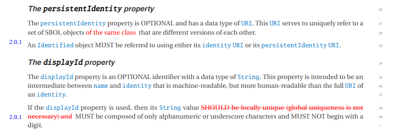

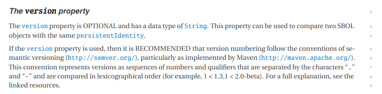

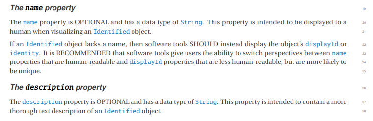

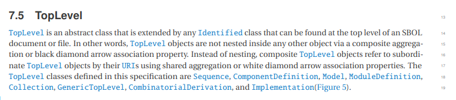

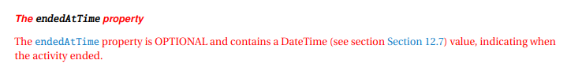

加上Activity后的BBa_B3202的DesignGraph表示：

```json
//BBa_B3202 DesignGraph
{
    "persistentIdentity": "BBa_B3202",
    "article": null,
    "description": null,
    "Activity": [ // BBa_B3202只有一个Activity
        {
            "persistentIdentity": "https://synbiohub.org/public/igem/igem2sbol",
            "displayId": "igem2sbol",
            "version": "1",
            "title": "iGEM to SBOL conversion",
            "description": "Conversion of the iGEM parts registry to SBOL2.1",
            "topLevel": "https://synbiohub.org/public/igem/igem2sbol/1",
            "ownedBy": "[\"https://synbiohub.org/user/james\", \"https://synbiohub.org/user/myers\"]",
            "creator": "[\"Chris J. Myers\", \"James Alastair McLaughlin\"]",
            "endedAtTime": "2017-03-06T15:00:00.000Z"
        }
    ],
}
```


### ComponentDefinition

表示单独的一个Device。

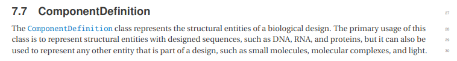

比如，下图中有名字的都是一个ComponentDefinition:

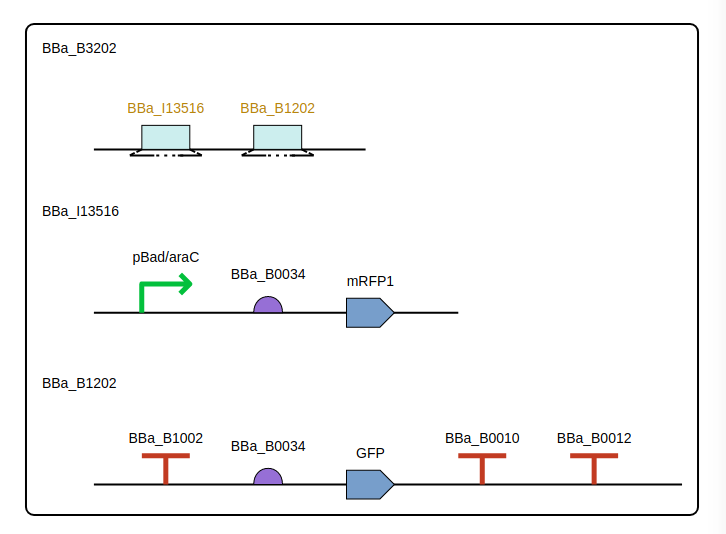

每一个ComponentDefinition的基本属性如下：

| attr               | explain |
| ------------------ | ------- |
| persistentIdentity | 独有ID  |
| displayId          |         |
| version            |         |
| wasDerivedFrom     |         |
| wasGeneratedBy     |         |
| title              |         |
| description        |         |
| created            |         |
| modified           |         |
| mutableProvenance  |         |
| topLevel           |         |
| mutableDescription |         |
| mutableNotes       |         |
| creator            |         |
| type               |         |
| role               |         |

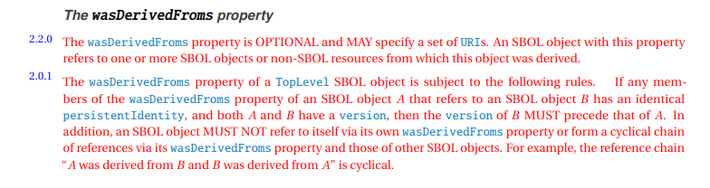

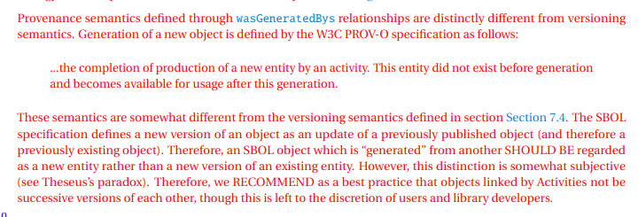

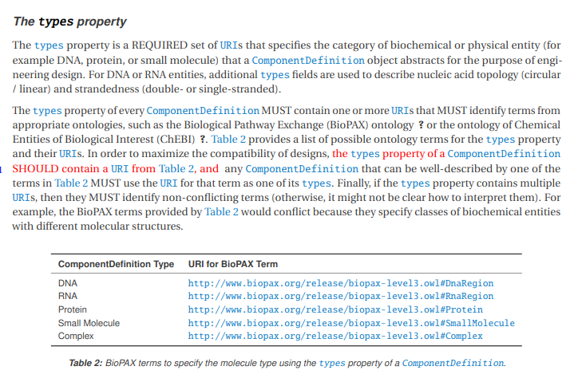

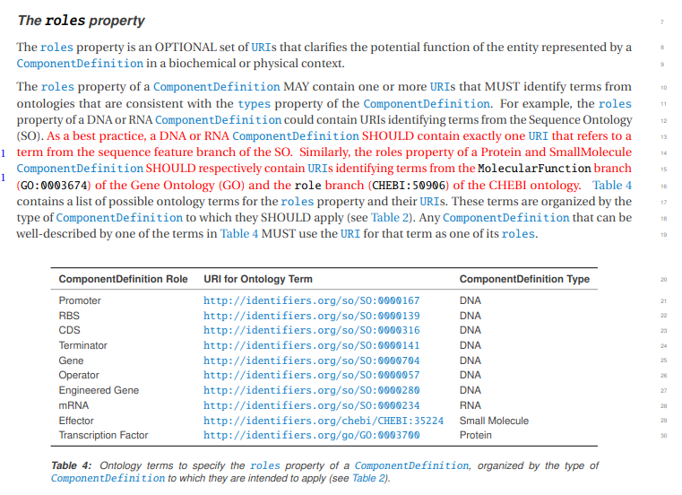

上图的ComponentDefinition中，BBa_B3202的具体表示如下：

```json
//BBa_B3202 ComponentDefinition
{
    "persistentIdentity": "https://synbiohub.org/public/igem/BBa_B3202",
    "displayId": "BBa_B3202",
    "version": "1",
    "wasDerivedFrom": "http://parts.igem.org/Part:BBa_B3202",
    "wasGeneratedBy": "https://synbiohub.org/public/igem/igem2sbol/1",
    "title": "BBa_B3202",
    "description": null,
    "created": "2007-01-29T12:00:00Z",
    "modified": "2015-08-31T04:07:22Z",
    "mutableProvenance": "antiquity",
    "topLevel": "https://synbiohub.org/public/igem/BBa_B3202/1",
    "mutableDescription": "final construct for screening terminator B1002",
    "mutableNotes": "final construct for screening terminators",
    "creator": "Haiyao Huang",
    "type": "http://www.biopax.org/release/biopax-level3.owl#DnaRegion",
    "role": [
        "Composite",
        "engineered_region"
    ]
    //.....
}
```


### Sequence 

每个ComponentDefinition有若干个序列（在我们的情况下一般只有一个）。基本属性如下：

| attr               | explain |
| ------------------ | ------- |
| persistentIdentity |         |
| displayId          |         |
| version            |         |
| wasDerivedFrom     |         |
| wasGeneratedBy     |         |
| topLevel           |         |
| ownedBy            |         |
| elements           |         |
| encoding           |         |

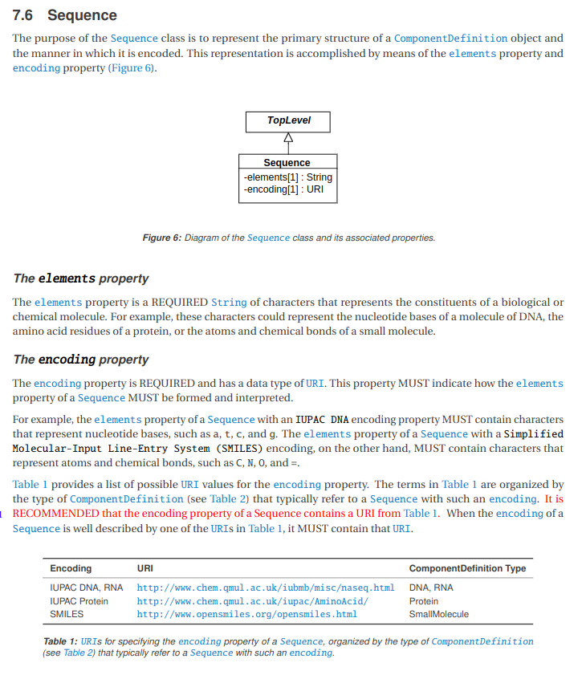

```json
//BBa_B3202 ComponentDefinition 加入了Sequence
{
    "persistentIdentity": "https://synbiohub.org/public/igem/BBa_B3202",
    "displayId": "BBa_B3202",
    "version": "1",
    "wasDerivedFrom": "http://parts.igem.org/Part:BBa_B3202",
    "wasGeneratedBy": "https://synbiohub.org/public/igem/igem2sbol/1",
    "title": "BBa_B3202",
    "description": null,
    "created": "2007-01-29T12:00:00Z",
    "modified": "2015-08-31T04:07:22Z",
    "mutableProvenance": "antiquity",
    "topLevel": "https://synbiohub.org/public/igem/BBa_B3202/1",
    "mutableDescription": "final construct for screening terminator B1002",
    "mutableNotes": "final construct for screening terminators",
    "creator": "Haiyao Huang",
    "type": "http://www.biopax.org/release/biopax-level3.owl#DnaRegion",
    "role": [
        "Composite",
        "engineered_region"
    ],
    "Sequence": [
        {
            "persistentIdentity": "https://synbiohub.org/public/igem/BBa_B3202_sequence",
            "displayId": "BBa_B3202_sequence",
            "version": "1",
            "wasDerivedFrom": "http://parts.igem.org/Part:BBa_B3202",
            "wasGeneratedBy": "https://synbiohub.org/public/igem/igem2sbol/1",
            "topLevel": "https://synbiohub.org/public/igem/BBa_B3202_sequence/1",
            "ownedBy": "[\"https://synbiohub.org/user/james\", \"https://synbiohub.org/user/myers\"]",
            "elements": "ttatgacaacttgacggctacatcattcactttttcttcacaaccggcacggaactcgctcgggctggccccggtgcattttttaaatacccgcgagaaatagagttgatcgtcaaaaccaacattgcgaccgacggtggcgataggcatccgggtggtgctcaaaagcagcttcgcctggctgatacgttggtcctcgcgccagcttaagacgctaatccctaactgctggcggaaaagatgtgacagacgcgacggcgacaagcaaacatgctgtgcgacgctggcgatatcaaaattgctgtctgccaggtgatcgctgatgtactgacaagcctcgcgtacccgattatccatcggtggatggagcgactcgttaatcgcttccatgcgccgcagtaacaattgctcaagcagatttatcgccagcagctccgaatagcgcccttccccttgcccggcgttaatgatttgcccaaacaggtcgctgaaatgcggctggtgcgcttcatccgggcgaaagaaccccgtattggcaaatattgacggccagttaagccattcatgccagtaggcgcgcggacgaaagtaaacccactggtgataccattcgcgagcctccggatgacgaccgtagtgatgaatctctcctggcgggaacagcaaaatatcacccggtcggcaaacaaattctcgtccctgatttttcaccaccccctgaccgcgaatggtgagattgagaatataacctttcattcccagcggtcggtcgataaaaaaatcgagataaccgttggcctcaatcggcgttaaacccgccaccagatgggcattaaacgagtatcccggcagcaggggatcattttgcgcttcagccatacttttcatactcccgccattcagagaagaaaccaattgtccatattgcatcagacattgccgtcactgcgtcttttactggctcttctcgctaaccaaaccggtaaccccgcttattaaaagcattctgtaacaaagcgggaccaaagccatgacaaaaacgcgtaacaaaagtgtctataatcacggcagaaaagtccacattgattatttgcacggcgtcacactttgctatgccatagcatttttatccataagattagcggatcctacctgacgctttttatcgcaactctctactgtttctccatacccgtttttttgggctagctactagagaaagaggagaaatactagatggcttcctccgaagacgttatcaaagagttcatgcgtttcaaagttcgtatggaaggttccgttaacggtcacgagttcgaaatcgaaggtgaaggtgaaggtcgtccgtacgaaggtacccagaccgctaaactgaaagttaccaaaggtggtccgctgccgttcgcttgggacatcctgtccccgcagttccagtacggttccaaagcttacgttaaacacccggctgacatcccggactacctgaaactgtccttcccggaaggtttcaaatgggaacgtgttatgaacttcgaagacggtggtgttgttaccgttacccaggactcctccctgcaagacggtgagttcatctacaaagttaaactgcgtggtaccaacttcccgtccgacggtccggttatgcagaaaaaaaccatgggttgggaagcttccaccgaacgtatgtacccggaagacggtgctctgaaaggtgaaatcaaaatgcgtctgaaactgaaagacggtggtcactacgacgctgaagttaaaaccacctacatggctaaaaaaccggttcagctgccgggtgcttacaaaaccgacatcaaactggacatcacctcccacaacgaagactacaccatcgttgaacagtacgaacgtgctgaaggtcgtcactccaccggtgcttaataacgctgatagtgctagtgtagatcgctactagagcgcaaaaaaccccgcttcggcggggttttttcgctactagagaaagaggagaaatactagatgcgtaaaggagaagaacttttcactggagttgtcccaattcttgttgaattagatggtgatgttaatgggcacaaattttctgtcagtggagagggtgaaggtgatgcaacatacggaaaacttacccttaaatttatttgcactactggaaaactacctgttccatggccaacacttgtcactactttcggttatggtgttcaatgctttgcgagatacccagatcatatgaaacagcatgactttttcaagagtgccatgcccgaaggttatgtacaggaaagaactatatttttcaaagatgacgggaactacaagacacgtgctgaagtcaagtttgaaggtgatacccttgttaatagaatcgagttaaaaggtattgattttaaagaagatggaaacattcttggacacaaattggaatacaactataactcacacaatgtatacatcatggcagacaaacaaaagaatggaatcaaagttaacttcaaaattagacacaacattgaagatggaagcgttcaactagcagaccattatcaacaaaatactccaattggcgatggccctgtccttttaccagacaaccattacctgtccacacaatctgccctttcgaaagatcccaacgaaaagagagaccacatggtccttcttgagtttgtaacagctgctgggattacacatggcatggatgaactatacaaataataatactagagccaggcatcaaataaaacgaaaggctcagtcgaaagactgggcctttcgttttatctgttgtttgtcggtgaacgctctctactagagtcacactggctcaccttcgggtgggcctttctgcgtttata",
            "encoding": "http://www.chem.qmul.ac.uk/iubmb/misc/naseq.html",
            "father_id": "https://synbiohub.org/public/igem/BBa_B3202"
        }
    ],
	// ...
}
```


### Component

每个ComponentDefinition有若干个子ComponentDefinition，由Component连接。

比如，上述BBa_B3202有两个子ComponentDefinition，分别为BBa_I13516和BBa_B1202。

```json
//BBa_B3202 ComponentDefinition 加入了Component关系
{
            "persistentIdentity": "https://synbiohub.org/public/igem/BBa_B3202",
            "displayId": "BBa_B3202",
            "version": "1",
            "wasDerivedFrom": "http://parts.igem.org/Part:BBa_B3202",
            "wasGeneratedBy": "https://synbiohub.org/public/igem/igem2sbol/1",
            "title": "BBa_B3202",
            "description": null,
            "created": "2007-01-29T12:00:00Z",
            "modified": "2015-08-31T04:07:22Z",
            "mutableProvenance": "antiquity",
            "topLevel": "https://synbiohub.org/public/igem/BBa_B3202/1",
            "mutableDescription": "final construct for screening terminator B1002",
            "mutableNotes": "final construct for screening terminators",
            "creator": "Haiyao Huang",
            "type": "http://www.biopax.org/release/biopax-level3.owl#DnaRegion",
            "role": [
                "Composite",
                "engineered_region"
            ],
            "Sequence": [
                {
                    "persistentIdentity": "https://synbiohub.org/public/igem/BBa_B3202_sequence",
                    "displayId": "BBa_B3202_sequence",
                    "version": "1",
                    "wasDerivedFrom": "http://parts.igem.org/Part:BBa_B3202",
                    "wasGeneratedBy": "https://synbiohub.org/public/igem/igem2sbol/1",
                    "topLevel": "https://synbiohub.org/public/igem/BBa_B3202_sequence/1",
                    "ownedBy": "[\"https://synbiohub.org/user/james\", \"https://synbiohub.org/user/myers\"]",
                    "elements": "ttatgacaacttgacggctacatcattcactttttcttcacaaccggcacggaactcgctcgggctggccccggtgcattttttaaatacccgcgagaaatagagttgatcgtcaaaaccaacattgcgaccgacggtggcgataggcatccgggtggtgctcaaaagcagcttcgcctggctgatacgttggtcctcgcgccagcttaagacgctaatccctaactgctggcggaaaagatgtgacagacgcgacggcgacaagcaaacatgctgtgcgacgctggcgatatcaaaattgctgtctgccaggtgatcgctgatgtactgacaagcctcgcgtacccgattatccatcggtggatggagcgactcgttaatcgcttccatgcgccgcagtaacaattgctcaagcagatttatcgccagcagctccgaatagcgcccttccccttgcccggcgttaatgatttgcccaaacaggtcgctgaaatgcggctggtgcgcttcatccgggcgaaagaaccccgtattggcaaatattgacggccagttaagccattcatgccagtaggcgcgcggacgaaagtaaacccactggtgataccattcgcgagcctccggatgacgaccgtagtgatgaatctctcctggcgggaacagcaaaatatcacccggtcggcaaacaaattctcgtccctgatttttcaccaccccctgaccgcgaatggtgagattgagaatataacctttcattcccagcggtcggtcgataaaaaaatcgagataaccgttggcctcaatcggcgttaaacccgccaccagatgggcattaaacgagtatcccggcagcaggggatcattttgcgcttcagccatacttttcatactcccgccattcagagaagaaaccaattgtccatattgcatcagacattgccgtcactgcgtcttttactggctcttctcgctaaccaaaccggtaaccccgcttattaaaagcattctgtaacaaagcgggaccaaagccatgacaaaaacgcgtaacaaaagtgtctataatcacggcagaaaagtccacattgattatttgcacggcgtcacactttgctatgccatagcatttttatccataagattagcggatcctacctgacgctttttatcgcaactctctactgtttctccatacccgtttttttgggctagctactagagaaagaggagaaatactagatggcttcctccgaagacgttatcaaagagttcatgcgtttcaaagttcgtatggaaggttccgttaacggtcacgagttcgaaatcgaaggtgaaggtgaaggtcgtccgtacgaaggtacccagaccgctaaactgaaagttaccaaaggtggtccgctgccgttcgcttgggacatcctgtccccgcagttccagtacggttccaaagcttacgttaaacacccggctgacatcccggactacctgaaactgtccttcccggaaggtttcaaatgggaacgtgttatgaacttcgaagacggtggtgttgttaccgttacccaggactcctccctgcaagacggtgagttcatctacaaagttaaactgcgtggtaccaacttcccgtccgacggtccggttatgcagaaaaaaaccatgggttgggaagcttccaccgaacgtatgtacccggaagacggtgctctgaaaggtgaaatcaaaatgcgtctgaaactgaaagacggtggtcactacgacgctgaagttaaaaccacctacatggctaaaaaaccggttcagctgccgggtgcttacaaaaccgacatcaaactggacatcacctcccacaacgaagactacaccatcgttgaacagtacgaacgtgctgaaggtcgtcactccaccggtgcttaataacgctgatagtgctagtgtagatcgctactagagcgcaaaaaaccccgcttcggcggggttttttcgctactagagaaagaggagaaatactagatgcgtaaaggagaagaacttttcactggagttgtcccaattcttgttgaattagatggtgatgttaatgggcacaaattttctgtcagtggagagggtgaaggtgatgcaacatacggaaaacttacccttaaatttatttgcactactggaaaactacctgttccatggccaacacttgtcactactttcggttatggtgttcaatgctttgcgagatacccagatcatatgaaacagcatgactttttcaagagtgccatgcccgaaggttatgtacaggaaagaactatatttttcaaagatgacgggaactacaagacacgtgctgaagtcaagtttgaaggtgatacccttgttaatagaatcgagttaaaaggtattgattttaaagaagatggaaacattcttggacacaaattggaatacaactataactcacacaatgtatacatcatggcagacaaacaaaagaatggaatcaaagttaacttcaaaattagacacaacattgaagatggaagcgttcaactagcagaccattatcaacaaaatactccaattggcgatggccctgtccttttaccagacaaccattacctgtccacacaatctgccctttcgaaagatcccaacgaaaagagagaccacatggtccttcttgagtttgtaacagctgctgggattacacatggcatggatgaactatacaaataataatactagagccaggcatcaaataaaacgaaaggctcagtcgaaagactgggcctttcgttttatctgttgtttgtcggtgaacgctctctactagagtcacactggctcaccttcgggtgggcctttctgcgtttata",
                    "encoding": "http://www.chem.qmul.ac.uk/iubmb/misc/naseq.html",
                    "father_id": "https://synbiohub.org/public/igem/BBa_B3202"
                }
            ],
            "Component": [
                {
                    "persistentIdentity": "https://synbiohub.org/public/igem/BBa_B3202/component2270279",
                    "displayId": "component2270279",
                    "version": "1",
                    "title": "BBa_I13516",
                    "topLevel": "https://synbiohub.org/public/igem/BBa_B3202/1",
                    "definition": "https://synbiohub.org/public/igem/BBa_I13516/1",
                    "access": "http://sbols.org/v2#public",
                    "father_id": "https://synbiohub.org/public/igem/BBa_B3202"
                },
                {
                    "persistentIdentity": "https://synbiohub.org/public/igem/BBa_B3202/component2270294",
                    "displayId": "component2270294",
                    "version": "1",
                    "title": "BBa_B1202",
                    "topLevel": "https://synbiohub.org/public/igem/BBa_B3202/1",
                    "definition": "https://synbiohub.org/public/igem/BBa_B1202/1",
                    "access": "http://sbols.org/v2#public",
                    "father_id": "https://synbiohub.org/public/igem/BBa_B3202"
                }
            ],
```


### SequenceAnnotation

整个ComponentDefinition有Sequence，使用SequenceAnnotation来标记Sequence中的某一段（表明这一段是上述Component关系指明的某个子ComponentDefinition的序列）。

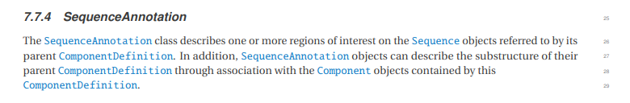

基本属性如下：

| attr               | explain |
| ------------------ | ------- |
| persistentIdentity |         |
| displayId          |         |
| version            |         |
| title              |         |
| topLevel           |         |
| component          |         |


SequenceAnnotation中包含Location信息，表示从Sequence的[start, end)这一段是标注的序列。

Location的基本属性如下：

| ATTR               | Explain |
| ------------------ | ------- |
| persistentIdentity |         |
| displayId          |         |
| version            |         |
| topLevel           |         |
| direction          |         |
| start              |         |
| end                |         |
| orientation        |         |
|                    |         |

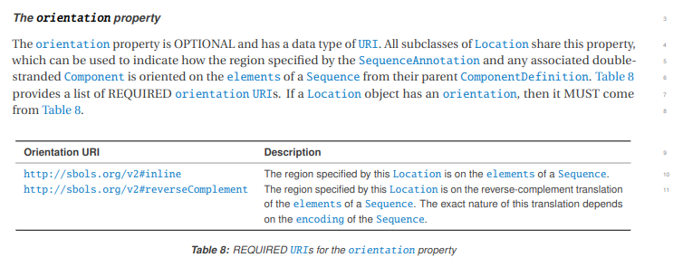


```json
// BBa_B3202 加入SequenceAnnotation信息
{
    "persistentIdentity": "https://synbiohub.org/public/igem/BBa_B3202",
    "displayId": "BBa_B3202",
    "version": "1",
    "wasDerivedFrom": "http://parts.igem.org/Part:BBa_B3202",
    "wasGeneratedBy": "https://synbiohub.org/public/igem/igem2sbol/1",
    "title": "BBa_B3202",
    "description": null,
    "created": "2007-01-29T12:00:00Z",
    "modified": "2015-08-31T04:07:22Z",
    "mutableProvenance": "antiquity",
    "topLevel": "https://synbiohub.org/public/igem/BBa_B3202/1",
    "mutableDescription": "final construct for screening terminator B1002",
    "mutableNotes": "final construct for screening terminators",
    "creator": "Haiyao Huang",
    "type": "http://www.biopax.org/release/biopax-level3.owl#DnaRegion",
    "role": "[\"Composite\", \"engineered_region\"]",
    "Sequence": [
        {
            "persistentIdentity": "https://synbiohub.org/public/igem/BBa_B3202_sequence",
            "displayId": "BBa_B3202_sequence",
            "version": "1",
            "wasDerivedFrom": "http://parts.igem.org/Part:BBa_B3202",
            "wasGeneratedBy": "https://synbiohub.org/public/igem/igem2sbol/1",
            "topLevel": "https://synbiohub.org/public/igem/BBa_B3202_sequence/1",
            "ownedBy": "[\"https://synbiohub.org/user/james\", \"https://synbiohub.org/user/myers\"]",
            "elements": "ttatgacaacttgacggctacatcattcactttttcttcacaaccggcacggaactcgctcgggctggccccggtgcattttttaaatacccgcgagaaatagagttgatcgtcaaaaccaacattgcgaccgacggtggcgataggcatccgggtggtgctcaaaagcagcttcgcctggctgatacgttggtcctcgcgccagcttaagacgctaatccctaactgctggcggaaaagatgtgacagacgcgacggcgacaagcaaacatgctgtgcgacgctggcgatatcaaaattgctgtctgccaggtgatcgctgatgtactgacaagcctcgcgtacccgattatccatcggtggatggagcgactcgttaatcgcttccatgcgccgcagtaacaattgctcaagcagatttatcgccagcagctccgaatagcgcccttccccttgcccggcgttaatgatttgcccaaacaggtcgctgaaatgcggctggtgcgcttcatccgggcgaaagaaccccgtattggcaaatattgacggccagttaagccattcatgccagtaggcgcgcggacgaaagtaaacccactggtgataccattcgcgagcctccggatgacgaccgtagtgatgaatctctcctggcgggaacagcaaaatatcacccggtcggcaaacaaattctcgtccctgatttttcaccaccccctgaccgcgaatggtgagattgagaatataacctttcattcccagcggtcggtcgataaaaaaatcgagataaccgttggcctcaatcggcgttaaacccgccaccagatgggcattaaacgagtatcccggcagcaggggatcattttgcgcttcagccatacttttcatactcccgccattcagagaagaaaccaattgtccatattgcatcagacattgccgtcactgcgtcttttactggctcttctcgctaaccaaaccggtaaccccgcttattaaaagcattctgtaacaaagcgggaccaaagccatgacaaaaacgcgtaacaaaagtgtctataatcacggcagaaaagtccacattgattatttgcacggcgtcacactttgctatgccatagcatttttatccataagattagcggatcctacctgacgctttttatcgcaactctctactgtttctccatacccgtttttttgggctagctactagagaaagaggagaaatactagatggcttcctccgaagacgttatcaaagagttcatgcgtttcaaagttcgtatggaaggttccgttaacggtcacgagttcgaaatcgaaggtgaaggtgaaggtcgtccgtacgaaggtacccagaccgctaaactgaaagttaccaaaggtggtccgctgccgttcgcttgggacatcctgtccccgcagttccagtacggttccaaagcttacgttaaacacccggctgacatcccggactacctgaaactgtccttcccggaaggtttcaaatgggaacgtgttatgaacttcgaagacggtggtgttgttaccgttacccaggactcctccctgcaagacggtgagttcatctacaaagttaaactgcgtggtaccaacttcccgtccgacggtccggttatgcagaaaaaaaccatgggttgggaagcttccaccgaacgtatgtacccggaagacggtgctctgaaaggtgaaatcaaaatgcgtctgaaactgaaagacggtggtcactacgacgctgaagttaaaaccacctacatggctaaaaaaccggttcagctgccgggtgcttacaaaaccgacatcaaactggacatcacctcccacaacgaagactacaccatcgttgaacagtacgaacgtgctgaaggtcgtcactccaccggtgcttaataacgctgatagtgctagtgtagatcgctactagagcgcaaaaaaccccgcttcggcggggttttttcgctactagagaaagaggagaaatactagatgcgtaaaggagaagaacttttcactggagttgtcccaattcttgttgaattagatggtgatgttaatgggcacaaattttctgtcagtggagagggtgaaggtgatgcaacatacggaaaacttacccttaaatttatttgcactactggaaaactacctgttccatggccaacacttgtcactactttcggttatggtgttcaatgctttgcgagatacccagatcatatgaaacagcatgactttttcaagagtgccatgcccgaaggttatgtacaggaaagaactatatttttcaaagatgacgggaactacaagacacgtgctgaagtcaagtttgaaggtgatacccttgttaatagaatcgagttaaaaggtattgattttaaagaagatggaaacattcttggacacaaattggaatacaactataactcacacaatgtatacatcatggcagacaaacaaaagaatggaatcaaagttaacttcaaaattagacacaacattgaagatggaagcgttcaactagcagaccattatcaacaaaatactccaattggcgatggccctgtccttttaccagacaaccattacctgtccacacaatctgccctttcgaaagatcccaacgaaaagagagaccacatggtccttcttgagtttgtaacagctgctgggattacacatggcatggatgaactatacaaataataatactagagccaggcatcaaataaaacgaaaggctcagtcgaaagactgggcctttcgttttatctgttgtttgtcggtgaacgctctctactagagtcacactggctcaccttcgggtgggcctttctgcgtttata",
            "encoding": "http://www.chem.qmul.ac.uk/iubmb/misc/naseq.html",
            "father_id": "https://synbiohub.org/public/igem/BBa_B3202"
        }
    ],
    "Component": [
        {
            "persistentIdentity": "https://synbiohub.org/public/igem/BBa_B3202/component2270279",
            "displayId": "component2270279",
            "version": "1",
            "title": "BBa_I13516",
            "topLevel": "https://synbiohub.org/public/igem/BBa_B3202/1",
            "definition": "https://synbiohub.org/public/igem/BBa_I13516/1",
            "access": "http://sbols.org/v2#public",
            "father_id": "https://synbiohub.org/public/igem/BBa_B3202"
        },
        {
            "persistentIdentity": "https://synbiohub.org/public/igem/BBa_B3202/component2270294",
            "displayId": "component2270294",
            "version": "1",
            "title": "BBa_B1202",
            "topLevel": "https://synbiohub.org/public/igem/BBa_B3202/1",
            "definition": "https://synbiohub.org/public/igem/BBa_B1202/1",
            "access": "http://sbols.org/v2#public",
            "father_id": "https://synbiohub.org/public/igem/BBa_B3202"
        }
    ],
    "SequenceAnnotation": [
        {
            "persistentIdentity": "https://synbiohub.org/public/igem/BBa_B3202/annotation2270279",
            "displayId": "annotation2270279",
            "version": "1",
            "title": "BBa_I13516",
            "topLevel": "https://synbiohub.org/public/igem/BBa_B3202/1",
            "component": "https://synbiohub.org/public/igem/BBa_B3202/component2270279/1",
            "father_id": "https://synbiohub.org/public/igem/BBa_B3202",
            "Location": [
                {
                    "persistentIdentity": "https://synbiohub.org/public/igem/BBa_B3202/annotation2270279/range2270279",
                    "displayId": "range2270279",
                    "version": "1",
                    "topLevel": "https://synbiohub.org/public/igem/BBa_B3202/1",
                    "direction": "http://wiki.synbiohub.org/wiki/Terms/igem#direction/reverse",
                    "start": 1,
                    "end": 1943,
                    "orientation": "http://sbols.org/v2#inline",
                    "father_id": "https://synbiohub.org/public/igem/BBa_B3202/annotation2270279"
                }
            ]
        },
        {
            "persistentIdentity": "https://synbiohub.org/public/igem/BBa_B3202/annotation2270294",
            "displayId": "annotation2270294",
            "version": "1",
            "title": "BBa_B1202",
            "topLevel": "https://synbiohub.org/public/igem/BBa_B3202/1",
            "component": "https://synbiohub.org/public/igem/BBa_B3202/component2270294/1",
            "father_id": "https://synbiohub.org/public/igem/BBa_B3202",
            "Location": [
                {
                    "persistentIdentity": "https://synbiohub.org/public/igem/BBa_B3202/annotation2270294/range2270294",
                    "displayId": "range2270294",
                    "version": "1",
                    "topLevel": "https://synbiohub.org/public/igem/BBa_B3202/1",
                    "direction": "http://wiki.synbiohub.org/wiki/Terms/igem#direction/reverse",
                    "start": 1951,
                    "end": 2868,
                    "orientation": "http://sbols.org/v2#inline",
                    "father_id": "https://synbiohub.org/public/igem/BBa_B3202/annotation2270294"
                }
            ]
        }
    ]
}
```


### 完整的BBa_B3202通路图

见BBa_B3202.json


