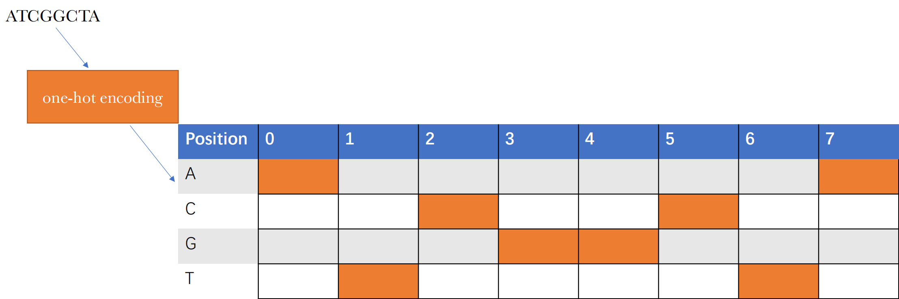
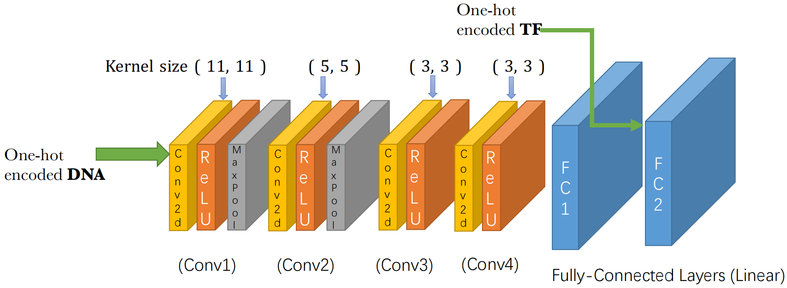

# iGEM-CNN-Regression
This is a model that based on open-source TF-biding-score database.  
## Data Source
1. Reddy TB, Riley R, Wymore F, Montgomery P, DeCaprio D, Engels R, Gellesch M, Hubble J, Jen D, Jin H, Koehrsen M, Larson L, Mao M, Nitzberg M, Sisk P, Stolte C, Weiner B, White J, Zachariah ZK, Sherlock G, Galagan JE, Ball CA, Schoolnik GK. TB database: an integrated platform for tuberculosis research. Nucleic Acids Res. 2009 Jan;37(Database issue):D499-508. doi: 10.1093/nar/gkn652. Epub 2008 Oct 3. PMID: 18835847; PMCID: PMC2686437.  
2. Ivan Yevshin, Ruslan Sharipov, Semyon Kolmykov, Yury Kondrakhin, Fedor Kolpakov, GTRD: a database on gene transcription regulation—2019 update, Nucleic Acids Research, Volume 47, Issue D1, 08 January 2019, Pages D100–D105, https://doi.org/10.1093/nar/gky1128  

## Data preprocessing
Since DNA and TF are both made up of a limited number of known components, inspring me of using one-hot encoding.   
One-hot encoding Digitize the characteristics of the classified values, here is an example shows how DNA could be encoded into matrix form to fit deep learning.  

## How to use it ?
If you don't have such deep learning background before, don't worry, this will only take a few minutes...  
1. Make sure your computer has a python compilation environment   
Installing python is very easy, see the tutorial here! [Let's begin with Python!](https://www.python.org/downloads/)   

2. Aha! Already with Python?  
    Use this command in cmd(command line mode in windows) below to let your computer have a same model like me!  
    ` $ git clone https://github.com/sysu-software-2020/iGEM-CNN-Regression.git  ` 

    To make sure you don't have to worry about annoying packages, you can install python dependencies here!  
    ` $ pip install -r requirements.txt ` 

    Then run local program to predict your result:
    1. YOUR_TF : TF name you need as variable  
    2. YOUR_DNA: biding-site you want to predict  

    `$ python predict.py YOUR_TF YOUR_DNA`

## IGEM graphic model
Our deep learning frame is shown here:  
  

See our (raw) model here: https://github.com/Lorisyy/iGEM-CNN-Regression/blob/main/CNN_wiki_v2.pdf

## Running details
Data processing.  
1. Run data_process/data_process.py which converts data to the csv file and get all_tf.csv, train_file.csv, test_file.csv, respectively
2. Run get_tf_txtfile.py to get the refined tf data in tf_txt.txt

This may confuse you somewhere, please contact me.
